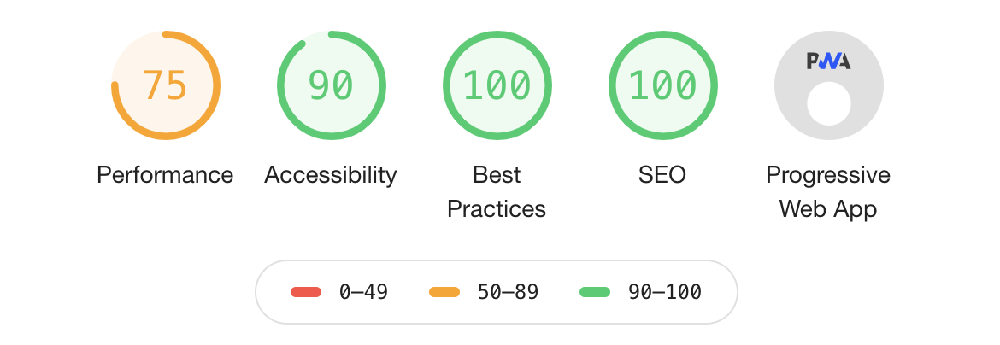

## About
  

 

This web page is built using GatsbyJS and React. GatsbyJS provides simple and effective tools to build strong static web pages. Post content is fetched from a Markdown file and processed through a template.
GatsbyJS uses GraphQL as data query tool. The ease of use, the poweful behind-the-scene data transformation make GraphQL deadly effective for static content.
This project is forked from [Smakosh/gatsby-portfolio-dev](https://github.com/smakosh/gatsby-portfolio-dev). The basic structure is provided but several other features had to be implemented.

## Features
- Hosted on Github and deployed with Netlify.
- Support of multi-lingual content with gatsby-plugin-i18n.
- SEO ready with react-helmet.
- Responsive.
- Styled-components and rendition for CSS styling.
- Dynamic styling with lightmode/darkmode feature.
- Markdown support and templating and YAML content support.
- Picture management with Sharp.
- Other neat details !

## Roadmap
1. Adding a blog page with written articles provided in markdown.
2. General performance and stability improvement.
3. More content and photos to come !