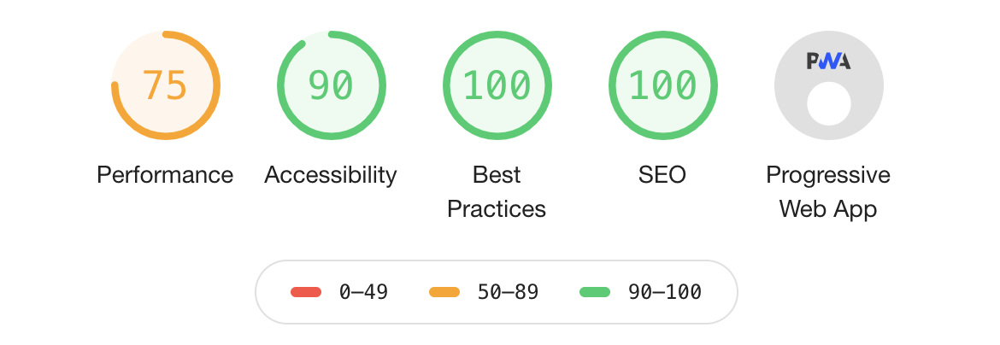

## À propos
  

 

Cette page web est développée avec GatsbyJS et React. GatsbyJS est une surcouche simple et efficace pour constuire des pages statiques robustes. Le contenu est approvisionné depuis des fichiers Markdown et devient du contenu html grâce à un système de template.
GatsbyJS utilise GraphQL comme outil de requête de données. La facilité d'utilisation et les puissantes fonctionnalités de transformation des données de GraphQL en font l'outil idéal pour gérer du contenu statique.
Ce projet est forké depuis [Smakosh/gatsby-portfolio-dev](https://github.com/smakosh/gatsby-portfolio-dev). Une structure basique est proposée mais beaucoup de fonctionnalités ont été ajoutées.
## Fonctionnalités
- Hébergée sur Github puis déployée sur Netlify.
- Support du multi-langue avec gatsby-plugin-i18n.
- Optimisation SEO avec react-helmet.
- Responsive.
- Styled-components et rendition pour les styles CSS.
- Styles dynamiques avec l'option mode clair/sombre.
- support du Markdown via le templating et support du YAML.
- Management des images avec Sharp.
- Et plein d'autre détails !

## Feuille de route
1. Ajouter une partie blog avec des articles rédigés en utilisant le Markdown.
2. Amélioration des performances générales et de la stabilité.
3. Plus de contenu et de photos à venir !