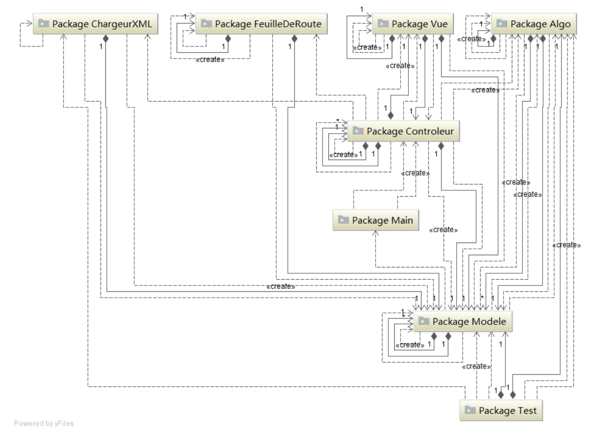

## À propos
Optimod'IF est un POC pour une solution applicative destinée aux véhicules de livraison qui optimise les trajets et propose un calcul de la tournée la plus efficace en prenant en compte des paramètres liés aux contraintes de temps et de logistique.
L'application est développée en Java et propose une IHM simplifiée utilisant Swing. 

## Parcours utilisateur
1. L'utilisateur charge un plan de la ville ou du quartier où il va faire une liste de livraisons. Les plans sont sauvegardés sous format XML sur le poste de travail.
2. L'utilisateur saisie les livraisons qu'il va effectuer avec des détails sur la localisation, l'horaire de passage et les éventuelles contraintes logistique (par exemple, la livraison doit être effectuée en premier, en dernier, en suivant une certaine route, etc...).
3. L'utilisateur peut à tout moment ajouter, supprimer ou modifier des détails sur chaque livraison ou sur la tournée en général. Il peut également ajouter des livraisons supplémentaires ou en enlever.
4. Le logiciel prend en compte les contraintes de l'utilisateur et calcule le trajet optimal à prendre pour réaliser le maximum de livraisons à temps.
5. L'utilisateur peut alors sauvegarder le trajet et télécharger une feuille de route avec les indications de déplacement.

## Implémentations
### Architecture
Nous implémentons le pattern **MVC** pour la structure générale de l'application. La couche contrôleur gère également les **Etats** (ou *States*) et adapte selon le contexte les opérations à réaliser par le logiciel. Une mécanique utilisant le pattern **Commande** est intégrée pour permettre la possibilité du *undo/redo*.

### Algorithmes de calcul
Le cas d'utilisation est une variante du problème du voyageur de commerce (TSP problem). C'est un problème NP-difficile et calculer une solution exacte n'est pas avisée.
Notre solution offre plusieurs méthodes de calcul :
* Une première approche est d'utiliser l'agorithme de Dijkstra sans heuristique afin d'aboutir à une solution en un temps de calcul minime. Cette solution n'est pas désirable car non optimale.
* Une deuxième solution est la méthode du Branch and Bound (BnB) qui utilise une heuristique de minimum-first pour élaguer les solutions non-optimales durant la recherche.
* Enfin, une dernière solution plus coûteuse en temps de calcul prend en compte les contraintes et optimise en choisissant des destinations qui satisfont au maximum les contraintes posées.

## Méthodologie AGILE
Le projet suit la stratégie Agile en 3 itérations. Notre équipe est composée de 6 personnes avec un architecte, deux développeurs et un responsable théorie et algorithme pour la partie technique, un chef de projet et un responsable de la communication pour la partie management. Il est à noter que les livrables sont rédigés par l'ensemble de l'équipe.

Chaque sprint est organisé de façon à pouvoir contribuer de manière significative à la réalisation du projet. Il est donc important de bien définir les objectifs et les répartir sur ces 3 périodes.

- La première phase est une phase de conception et de mise en place de l'architecture. Nous réalisons les diagrammes techniques (UML) et nous définissons le cahier des charges. Des discussions sont réalisés à intervalle régulier afin de dialoguer avec le client (ici, le corps enseignant) afin de valider notre avancement et discuter de possibles changements. Enfin, une première architecture est livrée.
- La deuxième phase est une période de développement pour mettre en place l'interface utilisateur, définir les algorithmes , les implémenter et préparer les livrables finaux. Une organisation des tests unitaires et tests d'intégration est également effectuée.
- La dernière phase se déroule après un entretien avec le client sur l'avancement et les modifications à apporter au projet. Après une mise à jour des besoins fonctionnels, nous terminons le développement et corrigeons les bugs relevés à partir des erreurs de test. Enfin, un essai est fait avec le client puis nous remettons le produit et les livrables.

## Conclusion
Ce projet fut une bonne occasion pour mettre en oeuvre une procédure agile dans un cadre scolaire où on est suivi de près par le corps enseignant et de pouvoir appliquer sur un cas concret les enseignements théoriques. Le projet finalement se présente comme un PoC pour un problème déjà existant.

Pour aller plus loin, ce projet peut être amélioré en mettant en place une architecture divisée en plusieurs composantes fonctionnelles : back-end avec interface REST, front-end pour les interactions utilisateur et analyse des données.