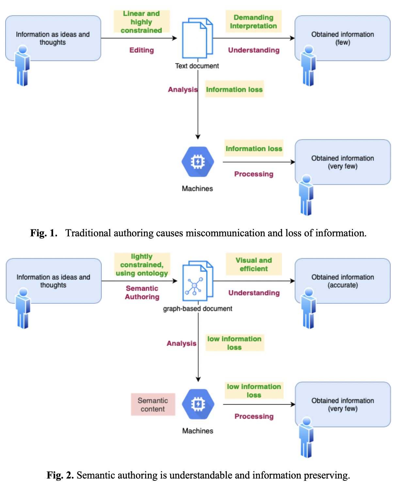
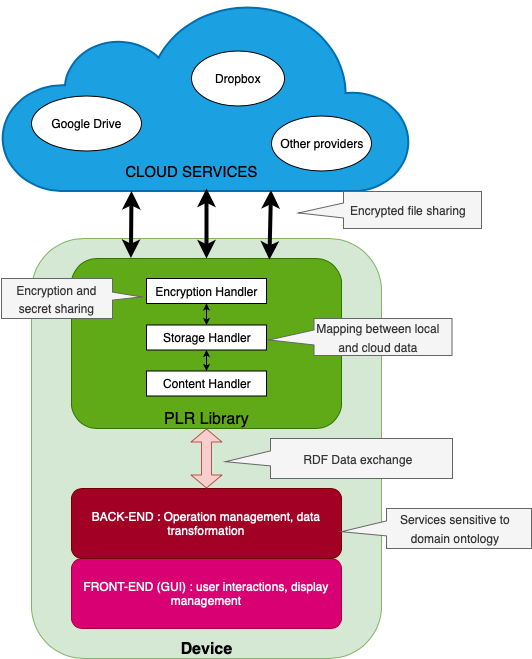

## À propos
Semantic Editor est un logiciel développé au sein du laboratoire du professeur Hasida Koiti de l'Université de Tokyo. Il est programmé en Java et peut donc fonctionner sur toute machine équipée de la Java Virtual Machine.

Le logicle présente deux fonctionnalités principales :
- **Edition de documents diagrammatiques (sous la forme d'un graphe) à contexte sémantique** : en utilisant une Interface Utilisateur épurée et fonctionnelle, les utilisateurs peuvent créer, modifier et supprimer des nœuds composés de texte et les liens entre ces nœuds. Un lien est annoté sémantiquement via une ontologie spécifiée et représente la relation logique entre deux nœuds.
- **Possibilité de collaborer à plusieurs en temps réel pour l'édition de documents diagrammatiques** : Nous utilisons une architecture basée sur le cloud pour réaliser la synchronisation des documents en temps-réel. La gestion des données est confiée au framework Personal Life Repository (PLR)[^1], un système de Personal Data Store (PDS) développé par le laboratoire.

## Motivations
Les études conduites sur la littératie adulte montrent que les compétences de lecture et d'écrire des individus est déséquilibrée à travers le globe et dépends fortement de la position sociale et de l'éducation reçue. Cette moyenne est aussi largement inférieure à la compétence d'analyse des machines. La représentation utilisant des graphes, où les idées ou sujets sont liés entre eux via des liens nommés, est un concept déjà exploité pour la représentation de structures de données. Du fait de la l'émergence progressive du Web Sémantique comme technologie de représentation des données conçues par l'humain ( par exemple en Natural Language Processing ou en Machine Learning), les machines peuvent comprendre significativement mieux un texte lorsqu'il est sémantiquement annoté.

Le consensus à l'heure actuelle pour l'exploitation de cette technologie est d'extraire de l'information utile depuis des documents non structurés et de la transformer pour que les machines puissent l'analyser. Nous pensons qu'utiliser directement des représentations de graphes pour les documents écrits serait plus productif pour l'écriture, la lecture et la compréhension des documents par les humains. Cependant, l'édition de documents utilisant une représentation en graphe n'est pas une méthode commune et il est nécessaire d'évaluer de quelle manière s'en servir pour optimiser ce système et obtenir une performance supérieure aux méthodes traditionnelles.

Une standardisation de ce type de document est nécessaire et a été proposée par le professeur Hasida. Semantic Editor sera utilisé pour la recherche dans un premier temps puis sera disponible au public.

## Spécifications techniques
### Architecture

Semantic Editor est conçu autour de la librairie PLR. De ce fait, les fonctionnalités du logiciel doivent supporter la norme PLR. Les données produites par Semantic Editor doivent donc être compatible avec tout autre application implémentant PLR. En outre, plusieurs aspects de notre logiciel tel que l'identification des utilisateurs ou la gestion de la sécurité et le chiffrement sont intégralement gérées par PLR.

En résumé, les tâches de management des données et du stockage sont confiées à PLR tandis que Semantic Editor sert comme application d'interaction vis-à-vis de l'utilisateur pour créer et éditer ces données.

### Ontologies
Semantic Editor inclus un domaine ontologique appelé "Discourse Semantic Authoring". Ce standard est composé de plus d'une cinquantaine de relations logiques pour définir les connecteurs de discours et de langage. Des liens tel que "*et*", "*élaboration*", "*comparaison*", "*but*", sont présents. Semantic Editor peut supporter virtuellement un nombre illimité d'ontologies et les données sont également compatibles avec d'autres sources du fait que nous utilisons le format RDF pour la modélisation.

### Front-end
Nous appellons front-end la partie IHM de l'application, celle directement en relation avec l'utilisateur. Nous utilisons JavaFX et plus précisément le format d'annotation FXML comme modèle. Cette méthode d'implémentation respecte le pattern MVC et facilite la maintenance. L'interface peut être divisée en deux parties : une partie s'occupe des opérations relatives aux actions pour l'édition de contenu et l'autre partie des opérations diverses tel que l'identification, le management des documents (création, suppression) et les paramètres.

Les mécaniques suivantes sont implémentées : zoom; déplacement; modification de taille; recentrage et changement de langue. Pour les outils d'édition, nous avons la création; la modification; la suppression; le formatage des noeuds; l'affichage des relations sémantiques et la relocation des entités.

### Back-end
Le back-end s'intéresse aux transactions entre la librarie PLR et les données enregistrées par le front. PLR est inclus comme un package Java et se considère comme une API. Une couche supplémentaire se charge de transformer les données de PLR en format compréhensible par le back-end et inversement.

Les formats pris en charge par PLR et Semantic Editor sont fortement hétérogènes. PLR est conçue avec la multi-compatibilité en tête et propose des formats généraux. Tout document aux yeux de PLR est un graphe et sont reliés dans l'ensemble sous la forme d'un arbre, puis sont stockés au format JSON-LD dans le cloud. Les modèles de données pour Semantic Editor sont plus formels et décrivent des graphes sémantiquement annotés. Une conversion est obligatoire lors du passage d'une entité à une autre.

### Synchronisation en temps réel
La synchronisation des documents est implémentée de façon asynchrone, les utilisateurs peuvent donc utiliser le logiciel sans perturbation durant la phase de synchronisation. Cela est permis grâce au multithreading pour toutes les transactions entre le cloud et Semantic Editor. Nous utilisons une méthode traditionnelle de synchronisation : un système centralisé où chaque terminal communique avec un serveur central et unique. Toutefois, ce système n'est pas adapté pour des appels à synchroniser récurrents et peine à garder le rythme avec les changements. Dans les meilleurs conditions, nous arrivons à un process de synchronisation prenant 2 secondes. De plus, cette technique introduit des conflits de lecture-écriture dans des mauvaises conditions d'utilisation.

Trois modes de fonctionnement ont été implémentés pour lutter contre ce phénomène : 
- Synchronisation automatique et périodique : un worker actionne une synchronisation avec le server toutes les X secondes. Cette méthode est similaire à du polling et n'est efficace que si l'utilisateur apporte également des changements périodiques au document.
- Déclenchement par évènement : le système délivre une synchronisation à chaque détection de changement. Cette méthode est la plus efficace et permet de garder une synchronisation quasi parfaite entre tous les utilisateurs. Néanmoins, cette méthode est aussi limitée par les capacités du serveur cloud et demande une charge computationelle plus élevée.
- Déclenchement manuel: dans ce cas la synchronisation est démarrée par l'utilisateur via un bouton. Cette façon est efficace si les utilisateurs sont en communication spontanée et s'entendent sur comment éditer le contenu.

## Conclusion et travaux futurs
Si Semantic Editor est exploitable à des fins de recherche et d'éducation, il n'a pas encore atteint un niveau de maturité suffisant pour être exposé au public. Des améliorations concernant la stabilité et la performance sont nécessaires. Enfin, une implémentation plus effective de la synchronisation doit être proposée. Nous pensons à un organisation en peer-to-peer entre les machines qui permet de transférer des petites charges de données rapidement et sans défaut de lecture-écriture. Cette approche est aussi plus conforme à la philosophie de PLR, qui prône une approche décentralisée sur le partage d'informations.

À l'heure actuelle, Semantic Editor a prouvé être performant pour l'édition de documents diagrammatiques et deux publications ont été soumises à EMNLP-IJCNLP 2019 et JIST 2019.

[^1]:  Hasida, K. (2012). Personal Life Repository as Foundation of B2C Services ― Big Data without Big Brother ―. The 21st Annual Frontiers in Service Conference, Maryland University.

